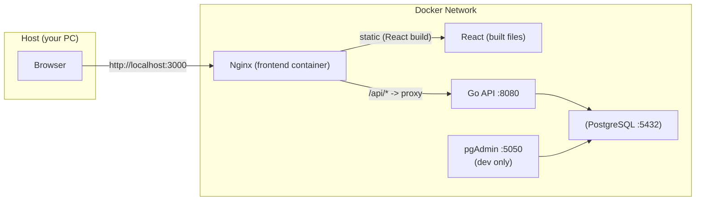
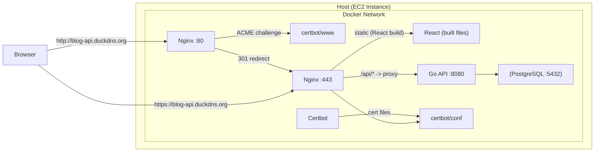

# BlogApi (Go言語 + PostgreSQL + React) - ポートフォリオ

Go標準の`net/http`を使って実装したブログAPI + Reactフロントエンドのポートフォリオです。  
JWT認証・認可、投稿/コメント/いいねのCRUD、Docker Composeによる開発、GitHub ActionsのCI、EC2 + Nginx + Certbot によるHTTPSデプロイまで含めています。

- **Backend**: Go + net/http + database/sql + PostgreSQL
- **Frontend**: React + Vite + Tailwind + Axios
- **Testing**: Playwright + Docker Compose
- **Infrastructure**: Docker Compose + Nginx + Certbot

---

## Architecture

### Local / Dev (開発・E2E)



### Production（EC2想定 / HTTPS）


---

## Design Principles

- フレームワークに依存しない設計を意識し、Go標準の`net/http`を採用しています。
- 開発・テスト環境の再現性を重視し、`Docker Compose`を統一基盤としています。
- 本番環境では`Nginx`のみ外部公開し、アプリケーションおよびDBは内部ネットワークに隔離しています。
- CIではローカルPCと同一手順を自動実行し、環境差異を最小化しています。
- context / timeout / errgroup を用いた、安全なキャンセル伝播とエラー処理を意識して設計しています。

---

## Graceful Shutdown / Signal Handling

本APIは、本番運用を想定し、SIGTERM/SIGINTに対するGraceful Shutdownに対応しています。
- `signal.NotifyContext` により SIGTERM / SIGINT を捕捉
- `http.Server.Shutdown()` を使用し、既存リクエスト完了を待機
- タイムアウト付きコンテキスト（10秒）で安全に終了
- `http.ErrServerClosed` を正常終了として扱い、exit code 0 を保証
- Docker環境では、PID1問題を考慮し、`go run` ではなくビルド済みバイナリを直接起動

これにより、以下の環境で安全に停止可能です：
- Docker Compose

---

## Repository Structure（抜粋）

- `.github` : GitHub ActionsのWorkflow / PRのテンプレートなど
- `cmd/api/` : APIサーバーのエントリポイント  
- `internal/` : handler / middleware / repository などアプリ本体  
- `infra/` : docker-compose（dev/test/prod）/ nginx設定 / utility
- `blog-api-frontend/` : Reactフロント（PlaywrightによるE2Eテスト含む）  
- `sql/` : DB初期化用のSQL
- `docs/` : Swagger / TODO などのドキュメント

---

## Requirements

- Docker / Docker Compose v2  
- Go 1.24.x :（ローカル直実行したい場合）  
- Node.js : （フロントをローカルで触りたい場合）  

---

## Quick Start（ローカルPCでの起動）

### 1) ソースコードをClone

```bash
git clone https://github.com/yusuke-hoguro/BlogApi.git
cd BlogApi
```

### 2) .env を作成

`./.env`の設定を確認してください。

```env
DB_USER=postgres
DB_PASSWORD=yourpassword
DB_NAME=blog
DB_PORT=5432
DB_TEST_NAME=blog_test
DB_HOST=db
JWT_SECRET=your_jwt_secret
APP_PORT=8080
EMAIL=portfolio@example.com
```

### 3) 開発環境を起動（推奨: Makefile）

makeコマンドを使用して操作が可能です。

起動：

```bash
make up-dev
```

- API: http://localhost:8080  
- Frontend: http://localhost:3000  
- pgAdmin: http://localhost:5050  

停止：

```bash
make down-dev
```
---

## Test

### Backend unit/integration（DockerでクリーンDB + go test）

makeコマンドを使用して実行することができます。

実行コマンド：

```bash
make test-go
```

- `infra/docker-compose.test.yml`で`postgres_test`コンテナを起動してから`go test`を実行します。
- テスト終了時にボリュームを削除して **毎回クリーンDB** で再現性を担保します。

---

### E2E（Playwright）

makeコマンドを使用して実行することができます。

実行コマンド：

```bash
make test-e2e
```

補足：

- `blog-api-frontend/playwright.config.ts`が`docker compose ... up --build frontend`を実行して環境を立ち上げます。
- global-setup で API の起動待ち + テストユーザー作成を行います。

---

## CI (GitHub Actions)

GitHub Actionsを使用したCIではローカルPCでのテストと同じ思想で、以下を自動実行します。

CIでのテスト内容：

- Backend Tests: テスト用のDocker Composeを使用してAPIの自動テストを実施します。  
- E2E Tests - Playwright: Playwrightを使用してフロントエンドからバックエンドまでのE2Eテストを実施します。

補足：

- `main`ブランチと`develop`ブランチへのPRおよびPush時に自動で実行されます。
- スケジューラを使用して毎日午前3：00に自動実行されます。
- makeコマンドを使用してローカルPCでCI相当のテストを実行することができます。

```bash
make ci-test
```
---

## API Spec

APIの仕様書はOpenAPI (OAS)形式で作成し、GitHub Pagesを利用してパブリックに公開しています。以下のリンクから、Swagger UI を通じて確認可能です。

Swagger UI（GitHub Pages）：https://yusuke-hoguro.github.io/BlogApi/

---

## Deployment (AWS EC2 + Nginx + Certbot)

`infra/docker-compose.prod.yml` を利用し、本番相当の構成で起動できます。

### 前提

- EC2（Ubuntu推奨）、80/443開放  
- DuckDNSのドメイン（例: `blog-api.duckdns.org`）  
- **現状 Nginx 設定（例: `infra/nginx/default.conf`）にドメインを直書き**
  - `server_name blog-api.duckdns.org;`
  - `ssl_certificate /etc/letsencrypt/live/blog-api.duckdns.org/fullchain.pem;`

### 起動

makeコマンドを使用して実行することができます。

実行コマンド：

```bash
make up-prod
```

### Nginx設定

各環境ごとに設定ファイルを分離しています。

開発環境：

- `infra/nginx/conf.d/blogapi.dev.conf`
  - HTTPのみ
  - ローカル開発用設定

本番環境：

- `infra/nginx/conf.d/blogapi.prod.conf`
  - HTTPS（SSL/TLS）対応
  - Let's Encrypt証明書参照
  - `/api`をAPI用コンテナへリバースプロキシ

### 証明書（初回発行・更新）

Let's Encryptの**webroot方式**で証明書を発行しています。

- 証明書保存先：`/etc/letsencrypt`
- Nginx が直接参照する構成

証明書の自動更新はGitHub Actionsの`Renew TLS certificates with Certbot` workflowを使用し、**毎日 03:00（JST）** にEC2内の`certbot`コンテナを起動して実行しています。

---

## Make Commands

BlogAPIで使用できる主要な`make`コマンドです。

```bash
make up-dev        # 開発環境起動（docker-compose.yml 使用）
make down-dev      # 開発環境停止
make test-go       # Backendテスト実行（test用compose起動 → DB初期化 → go test）
make test-e2e      # E2Eテスト実行（Playwright）
make ci-test       # CI相当のまとめ実行
make fe-install    # フロントエンド依存関係インストール
make fe-dev        # フロント開発サーバー起動（Vite）
```

---

## Roadmap / TODO

現在の改善計画・技術的課題は`docs/issue/TODO_LIST.md`にまとめています。

---

## Author

Goでのバックエンド開発力（API設計/テスト/CICD/デプロイ）を実務レベルに引き上げる目的で作成したポートフォリオです。
