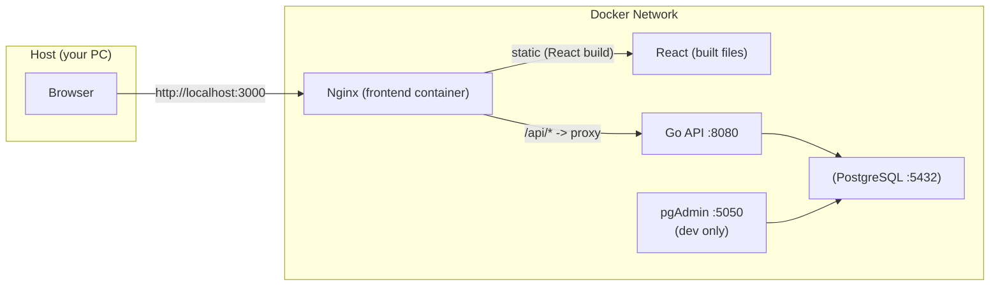
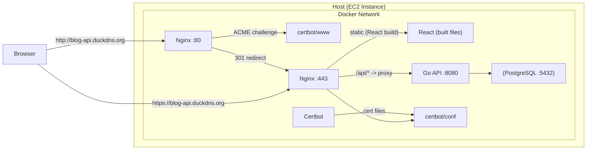

# BlogApi (Go言語 + PostgreSQL + React) - ポートフォリオ

Go標準の`net/http`を使って実装したブログAPI + Reactフロントエンドのポートフォリオです。  
JWT認証・認可、投稿/コメント/いいねのCRUD、Docker Composeによる開発、GitHub ActionsのCI、Dependabotによる依存関係更新、EC2 + Nginx + Certbot によるHTTPSデプロイまで含めています。

- **Backend**: Go + net/http + database/sql + PostgreSQL
- **Frontend**: React + Vite + Tailwind + Axios
- **Testing**: Playwright (Chromium / Firefox / WebKit) + Docker Compose
- **Infrastructure**: Docker Compose + AWS EC2 + Nginx + Certbot + EventBridge + CloudWatch
- **Maintenance**: DependabotによるGo / npm / Docker / Docker Compose / GitHub Actionsの依存関係更新

---

## Architecture

### Local / Dev (開発・E2E)



### Production（EC2想定 / HTTPS）


---

## Design Principles

- フレームワークに依存しない設計を意識し、Go標準の`net/http`を採用しています。
- 開発・テスト環境の再現性を重視し、`Docker Compose`を統一基盤としています。
- 本番環境では`Nginx`のみ外部公開し、アプリケーションおよびDBは内部ネットワークに隔離しています。
- CIではローカルPCと同一手順を自動実行し、環境差異を最小化しています。
- Dependabotでバックエンド、フロントエンド、コンテナ、CIの依存関係を定期的に確認し、更新漏れを防ぐ構成にしています。
- context / timeout / errgroup を用いた、安全なキャンセル伝播とエラー処理を意識して設計しています。

---

## Graceful Shutdown / Signal Handling

本APIは、本番運用を想定し、SIGTERM/SIGINTに対するGraceful Shutdownに対応しています。
- `signal.NotifyContext` により SIGTERM / SIGINT を捕捉
- `http.Server.Shutdown()` を使用し、既存リクエスト完了を待機
- タイムアウト付きコンテキスト（10秒）で安全に終了
- `http.ErrServerClosed` を正常終了として扱い、exit code 0 を保証
- Docker環境では、PID1問題を考慮し、`go run` ではなくビルド済みバイナリを直接起動

これにより、以下の環境で安全に停止可能です：
- Docker Compose

---

## Repository Structure（抜粋）

- `.github` : GitHub ActionsのWorkflow / PRのテンプレートなど
- `cmd/api/` : APIサーバーのエントリポイント  
- `internal/` : handler / service / repository / middleware などアプリ本体  
- `infra/` : docker-compose（dev/test/prod）/ nginx設定 / utility
- `blog-api-frontend/` : Reactフロント（PlaywrightによるE2Eテスト含む）  
- `sql/` : DB初期化用SQL / マイグレーションSQL
- `docs/` : Swagger / TODO などのドキュメント

---

## Requirements

- Docker / Docker Compose v2  
- Go 1.25.x :（ローカル直実行したい場合）  
- Node.js : （フロントをローカルで触りたい場合）  

---

## Quick Start（ローカルPCでの起動）

### 1) ソースコードをClone

```bash
git clone https://github.com/yusuke-hoguro/BlogApi.git
cd BlogApi
```

### 2) .env を作成

`./.env`の設定を確認してください。

```env
DB_USER=postgres
DB_PASSWORD=yourpassword
DB_NAME=blog
DB_PORT=5432
DB_TEST_NAME=blog_test
DB_HOST=db
JWT_SECRET=your_jwt_secret
APP_PORT=8080
EMAIL=portfolio@example.com
```

### 3) 開発環境を起動（推奨: Makefile）

makeコマンドを使用して操作が可能です。

起動：

```bash
make up-dev
```

- API: http://localhost:8080  
- Frontend: http://localhost:3000  
- pgAdmin: http://localhost:5050  

停止：

```bash
make down-dev
```
---

## DB Migration

DBスキーマ変更を安全に管理するため、SQLベースのマイグレーション機能を実装しています。

- マイグレーションSQLは `sql/migrations` 配下で管理
- 適用済みマイグレーションはDB内の `schema_migrations` テーブルに記録
- 未適用のSQLファイルだけをファイル名順に実行
- 各マイグレーションはトランザクション内で実行し、成功時のみ適用済みとして記録
- `sql/init.sql` は新規DB初期化用、既存DBの更新はマイグレーションで実施

今回のように既存DBへ新しいテーブルを追加する場合でも、Docker volume や本番DBを作り直さずにスキーマを更新できる構成にしています。

### 開発環境での実行

Docker Composeの開発環境では、appコンテナ内でマイグレーションを実行します。

```bash
make migrate-dev
```

Docker外のローカル環境から実行する場合は、`.env` の `DB_HOST` が `localhost` などホストPCから到達可能な値になっている必要があります。

```bash
make migrate
```

### 本番環境での運用

本番デプロイでは、`infra/utilitys/deploy/deploy.sh` の中でアプリケーション起動前にマイグレーションを実行します。

デプロイスクリプトは以下の順序で実行されます。

```text
appイメージをbuild
DBコンテナを起動
DBの起動完了を待機
appイメージの一時コンテナで ./migrate を実行
マイグレーション成功後に全サービスを起動
```

マイグレーションに失敗した場合は `deploy.sh` が停止し、アプリケーションの起動処理には進みません。

---

## Test

### Backend unit/integration（DockerでクリーンDB + go test）

makeコマンドを使用して実行することができます。

実行コマンド：

```bash
make test-go
```

- `infra/docker-compose.test.yml`で`postgres_test`コンテナを起動してから`go test`を実行します。
- テスト終了時にボリュームを削除して **毎回クリーンDB** で再現性を担保します。

---

### E2E（Playwright）

makeコマンドを使用して実行することができます。

初回のみPlaywright用ブラウザをインストールします。

```bash
make pw-install
```

Linux / WSL 環境でOS側の依存ライブラリもまとめて入れたい場合は、フロントエンドディレクトリで以下を実行します。

```bash
cd blog-api-frontend
npx playwright install --with-deps
```

実行コマンド：

```bash
make test-e2e
```

補足：

- E2Eテストは Playwright の projects 機能を使用し、Chromium / Firefox / WebKit の3ブラウザで実行します。
- `blog-api-frontend/playwright.config.ts`が`docker compose ... up --build frontend`を実行して環境を立ち上げます。
- global-setup で API の起動待ち + テストユーザー作成を行います。
- UIモードで確認したい場合は`make pw-ui`、操作を記録しながらテストを作る場合は`make pw-codegen`を使用します。
- Codegenの起動URLを変えたい場合は`make pw-codegen PW_URL=http://localhost:3000/posts`のように指定できます。

---

## CI (GitHub Actions)

GitHub Actionsを使用したCIではローカルPCでのテストと同じ思想で、以下を自動実行します。

CIでのテスト内容：

- Backend Tests: テスト用のDocker Composeを使用してAPIの自動テストを実施します。  
- E2E Tests - Playwright: Chromium / Firefox / WebKit の3ブラウザで、フロントエンドからバックエンドまでのE2Eテストを実施します。

補足：

- `main`ブランチと`develop`ブランチへのPRおよびPush時に自動で実行されます。
- スケジューラを使用して毎日午前3：00に自動実行されます。
- makeコマンドを使用してローカルPCでCI相当のテストを実行することができます。

```bash
make ci-test
```
---

## Dependency Updates (Dependabot)

依存関係の更新を継続的に確認するため、Dependabotを導入しています。

- Go modules: `go.mod` / `go.sum`
- Frontend npm: `blog-api-frontend/package.json` / `package-lock.json`
- Docker images: ルートおよびフロントエンドの`Dockerfile`
- Docker Compose: `infra/docker-compose*.yml`
- GitHub Actions: `.github/workflows`

ポートフォリオ開発の進行を優先するため、依存関係の確認は月次で実行し、各エコシステムごとの未完了 Pull Request は最大3件までに制限しています。

補足：

- パッチ・マイナー更新は通常の依存更新としてPull Requestで確認します。
- メジャーバージョン更新は通常のDependabot PR対象から除外し、Issue / TODOで移行可否と影響範囲を確認します。
- DBやランタイムなどのメジャーバージョン更新は、移行手順・ロールバック方針・CI検証を整理したうえで別タスクとして扱います。

---

## API Spec

APIの仕様書はOpenAPI (OAS)形式で作成し、GitHub Pagesを利用してパブリックに公開しています。以下のリンクから、Swagger UI を通じて確認可能です。

Swagger UI（GitHub Pages）：https://yusuke-hoguro.github.io/BlogApi/

---

## Deployment (AWS EC2 + Nginx + Certbot)

`infra/docker-compose.prod.yml` を利用し、本番相当の構成で起動できます。

### 前提

- EC2（Ubuntu推奨）、80/443開放  
- DuckDNSのドメイン（例: `blog-api.duckdns.org`）  
- **現状 Nginx 設定（例: `infra/nginx/default.conf`）にドメインを直書き**
  - `server_name blog-api.duckdns.org;`
  - `ssl_certificate /etc/letsencrypt/live/blog-api.duckdns.org/fullchain.pem;`

### 起動

makeコマンドを使用して実行することができます。

実行コマンド：

```bash
make up-prod
```

### Nginx設定

各環境ごとに設定ファイルを分離しています。

開発環境：

- `infra/nginx/conf.d/blogapi.dev.conf`
  - HTTPのみ
  - ローカル開発用設定

本番環境：

- `infra/nginx/conf.d/blogapi.prod.conf`
  - HTTPS（SSL/TLS）対応
  - Let's Encrypt証明書参照
  - `/api`をAPI用コンテナへリバースプロキシ

### AWS / EC2 運用構成

ポートフォリオとして本番運用を想定し、EC2インスタンスの起動・停止、異常終了通知、IP更新、TLS証明書更新まで自動化しています。

- EC2インスタンス上でDocker Composeによりアプリケーションを起動
- EBSは運用ログやDockerイメージの増加を考慮して **20GB** に拡張
- CloudWatchでEC2インスタンスの異常終了を検知し、Eメールで通知
- Amazon EventBridge Schedulerで毎日 **09:00（JST）** にEC2インスタンスを起動
- Amazon EventBridge Schedulerで毎日 **18:00（JST）** にEC2インスタンスを停止
- Amazon EventBridge RuleでEC2インスタンスの停止イベントを検知し、Eメールで通知

### デプロイ

EC2インスタンスへのデプロイはGitHub Actionsの手動workflowで実行します。

- Workflow: `.github/workflows/deploy.yml`
- 実行方法: GitHub Actionsの`Deploy to AWS`を`workflow_dispatch`で手動実行
- 対象ブランチ: `main`のみ
- デプロイ前にGitHub Environment `production` の承認が必須
- 承認後も、対象コミットが最新の`main`であること、必須CIが成功していることを確認してからEC2へデプロイ
- デプロイ時はEC2上の `infra/utilitys/deploy/deploy.sh` が実行され、DB起動確認後に `./migrate` を実行してからアプリケーションを起動

### TLS証明書（初回発行・更新）

Let's Encryptの**webroot方式**で証明書を発行しています。

- 証明書保存先：`/etc/letsencrypt`
- Nginx が直接参照する構成
- TLS証明書の自動更新はEC2インスタンス内のcronで **毎日 09:30（JST）** に実行
- GitHub Actionsの`Renew TLS certificates with Certbot` workflowからも手動実行可能

### DuckDNS / Dynamic DNS

EC2のパブリックIP変更に追従するため、DuckDNSへのIP通知を自動化しています。

- EC2インスタンス内のcronで **5分ごと** にDuckDNSへ現在のIPを通知
- `blog-api.duckdns.org` が常に稼働中のEC2インスタンスを指すように維持

---

## Make Commands

BlogAPIで使用できる主要な`make`コマンドです。

```bash
make up-dev        # 開発環境起動（docker-compose.yml 使用）
make down-dev      # 開発環境停止
make logs-dev      # 開発環境ログ表示
make ps-dev        # 開発環境コンテナ状態確認
make test-go       # Backendテスト実行（test用compose起動 → DB初期化 → go test）
make test-e2e      # E2Eテスト実行（Playwright）
make pw-install    # Playwright用ブラウザをインストール
make pw-test       # Playwrightテスト実行
make pw-ui         # Playwright UIモードでテスト実行
make pw-codegen    # Playwright Codegen起動（PW_URLでURL指定可）
make pw-report     # Playwright HTMLレポート表示
make go-lint       # golangci-lint実行
make ci-test       # CI相当のまとめ実行
make migrate       # ローカル環境からDBマイグレーション実行
make migrate-dev   # 開発用appコンテナ内でDBマイグレーション実行
make migrate-prod  # 本番用appコンテナ内でDBマイグレーション実行
make fe-install    # フロントエンド依存関係インストール
make fe-dev        # フロント開発サーバー起動（Vite）
make fe-build      # フロントエンドビルド
make fe-preview    # フロントエンドビルドのプレビュー起動
```

---

## Roadmap / TODO

現在の改善計画・技術的課題は`docs/issue/TODO_LIST.md`にまとめています。

---

## Author

Goでのバックエンド開発力（API設計/テスト/CICD/デプロイ）を実務レベルに引き上げる目的で作成したポートフォリオです。
